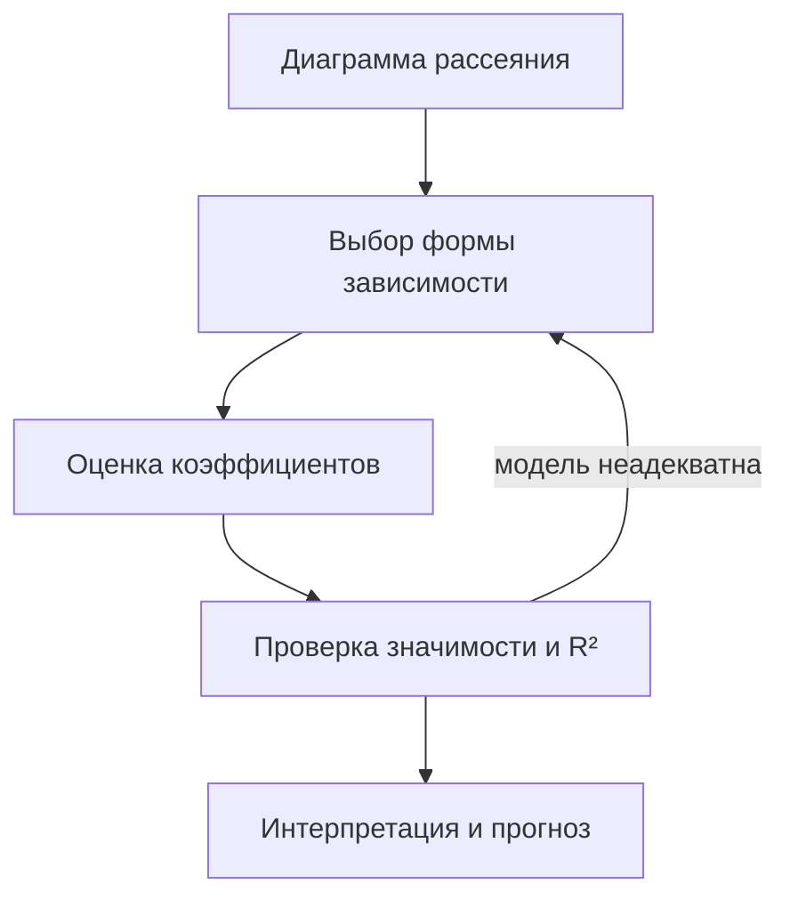

# Классическая модель парной линейной регрессии

## Кратко

- Эконометрика решает две задачи: **прогноз** значения зависимой переменной и **анализ структуры** — выяснение экономического смысла коэффициентов.
- Модель парной регрессии: $y = \alpha + \beta x + \varepsilon$. Всё, что не объяснено единственным фактором $x$, уходит в случайный член $\varepsilon$.
- Любое эконометрическое исследование начинается с диаграммы рассеяния. Модель, построенная без взгляда на график, — типичная ошибка, за которую снижают оценку.
- $R^2$ показывает, какая доля дисперсии $y$ объяснена моделью. Высокий $R^2$ сам по себе не делает модель адекватной.
- Коэффициент $b$ — это изменение $y$ при росте $x$ на единицу, то есть «очищенная» от прочих факторов цена единицы фактора. Свободный член $a$ экономического смысла обычно не имеет.
- Для адекватной модели нужно не менее 30 наблюдений (25 — если заведомо выполнены условия Гаусса—Маркова).

## Место дисциплины

Курс делится на две несхожие части, чтобы показать: методы математического моделирования существенно зависят от области применения.

1. **Эконометрика** — построение регрессионных моделей.
2. **Моделирование систем массового обслуживания.**

Эконометрика — живая, активно развивающаяся часть математики: в отличие от матанализа, где изучается материал двухсотлетней давности, здесь методы обновляются постоянно. Пример: подход к гетероскедастичности, при котором её сначала детектируют, а затем на той же выборке от неё избавляются, около 15 лет назад был математически признан некорректным, хотя в практике компаний применялся ещё долго.

Эконометрика относится к тем разделам математики, которые нельзя применять в отрыве от реальности (наряду с матстатистикой и многомерными статметодами). Однозначно правильных и однозначно неправильных моделей здесь нет: два опытных эконометриста построят разные, хотя и близкие модели.

## Две задачи эконометрики

| Задача | Суть | Разновидности |
|---|---|---|
| Прогноз | Подставить нужное значение $x$ в уравнение и получить $y$ | **интерполяция** — значение внутри диапазона выборки; **экстраполяция** — за его пределами (например, прогноз цены нефти на следующий квартал) |
| Анализ структуры | Выяснить экономический смысл коэффициентов модели | цена единицы фактора, эластичность |

Обе задачи разбираются на сквозном примере: выборка из 10 наблюдений «площадь квартиры (кв. футы) — цена (тыс. \$)».

Почему нельзя обойтись без модели: нужной площади (1500 кв. футов) в выборке просто нет, а если бы и была — реально одной площади соответствует не одна цена, а целый диапазон. Регрессионная связь как раз и означает, что каждому значению $x$ соответствует диапазон значений $y$.

## Порядок работы



## Модель и её составляющие

$$y = \alpha + \beta x + \varepsilon$$

Величина $y$ состоит из двух частей: неслучайной составляющей $\alpha + \beta x$, где $x$ — объясняющая (независимая) переменная, и **случайного члена** $\varepsilon$. В случайный член уходит влияние всех неучтённых факторов: для цены квартиры это этаж, материал дома, ремонт, район, транспортная доступность, соседи, а также субъективные предпочтения покупателя.

Из-за $\varepsilon$ точные значения $\alpha$ и $\beta$ по выборке найти нельзя — их можно только **оценить**. Оценки обозначают $a$ и $b$:

$$\hat{y} = a + bx, \qquad y_i = a + bx_i + e_i$$

Здесь $e_i$ — **остатки регрессии**, выборочные оценки случайного члена: расхождение между фактическим и спрогнозированным значением $y$. На диаграмме рассеяния это вертикальные отрезки от точки до линии регрессии.

## Выбор формы зависимости

В Excel линия тренда строится по одному клику, поэтому соблазн взять первую попавшуюся форму велик. Сравнение на данных о квартирах:

| Модель | $R^2$ | Что не так |
|---|---|---|
| Линейная | ≈ 0,80 | прямая плохо ложится на облако точек |
| Полином 2-й степени | ≈ 0,90 | после вершины парабола идёт вниз: цена падает с ростом площади — бессмыслица |
| Логарифмическая | ≈ 0,89 | экономически осмысленна, $R^2$ почти как у параболы |

Вывод: формальное качество подгонки и содержательная осмысленность — разные вещи. Парабола выигрывает по $R^2$, но её поведение при больших площадях противоречит предметной области.

## Коэффициент детерминации

**Дисперсия** — мера изменчивости величины: отклонения каждого наблюдения от среднего возводятся в квадрат (чтобы плюсы и минусы не сократились — сумма отклонений от среднего арифметического строго равна нулю) и усредняются.

$$\mathrm{Var}(y) = \frac{1}{n}\sum_{i=1}^{n}(y_i - \bar{y})^2$$

Модуль вместо квадрата не берут: в методе наименьших квадратов он не работает.

**Коэффициент детерминации $R^2$** — доля дисперсии $y$, объяснённая уравнением регрессии. Если $R^2 = 0{,}90$, то на 90% изменчивость цены объясняется изменчивостью площади, а оставшиеся 10% приходятся на все прочие факторы вместе с необъяснённой случайностью. Максимум $R^2$ равен единице (все остатки нулевые); при отсутствии линейной связи $R^2$ близок к нулю.

## Интерпретация коэффициентов

Для линейной модели цены квартиры $\hat{y} = 0{,}1065x + 92$ (цена в тыс. \$, площадь в кв. футах):

- **$b = 0{,}1065$** — на столько изменится цена при росте площади на один квадратный фут, то есть цена одного квадратного фута: 106,5 \$.
- **$a = 92$** — формально цена квартиры площадью 0. Прямого экономического смысла не имеет: значение $x = 0$ лежит далеко за пределами выборки.

Почему коэффициент $b$ лучше, чем «суммарная цена / суммарная площадь». Простое частное вбирает в себя влияние этажа, материала дома, района и всего остального. Коэффициент регрессии даёт цену метра **в чистом виде**, без влияния прочих факторов, — это и есть решение задачи анализа структуры.

## Когда одной кривой мало

Облако точек в примере распадается на два участка: примерно до 100 кв. м работает одна модель ценообразования, выше — другая. Это правдоподобно содержательно: у покупателя квартиры 35 кв. м и покупателя 220 кв. м разные требования и разные механизмы формирования цены. Непрерывная кривая через оба участка здесь сомнительна.

Как это оформить:

- **Разбить выборку на две подвыборки** — плохо: из 30 наблюдений получится две по 15, надёжных выводов не сделать.
- **Ввести фиктивную переменную** (0 для одной группы, 1 для другой) — выборка фактически делится, а число степеней свободы уменьшается незначительно.

Термин «фиктивная переменная» — неудачный перевод: ничего фиктивного в ней нет, в литературе чаще используют *dummy-переменная*.

Кластеризация здесь избыточна — это метод многомерного статанализа, задача решается проще.

## Требования к данным

- **Объём выборки:** не менее 30 наблюдений; 25 — если заранее известно, что условия Гаусса—Маркова выполнены. 10 наблюдений — заведомо мало.
- **Выбросы:** чаще всего их удаляют, но это спорный подход. Удаляя выброс, мы подгоняем действительность под удобную модель, тогда как задача обратная — построить модель действительности. Если есть способ обойтись без удаления, лучше им воспользоваться.

## Практика: R и вывод `summary`

Расчёты в курсе ведутся на **R** и **Python**. R старше Python и написан статистиками для статистиков, поэтому специфичен и в статистических задачах читается проще. Он же — фактический стандарт публикаций: западные журналы требуют выкладывать вместе со статьёй исходные данные и код на R, чтобы результат можно было воспроизвести.

Пример на данных «возраст — опыт — доход», 20 наблюдений:

```r
df <- read.csv("data.csv", sep = ",", dec = ".")
str(df)            # структура фрейма данных
x <- df$Возраст
y <- df$Доход
model <- lm(y ~ x) # линейная модель: y зависит от x
summary(model)
```

**Фрейм данных** отличается от матрицы тем, что разные столбцы могут иметь разный тип данных. Если в коде на R появился цикл `for`, программу почти наверняка можно переписать через векторные операции — они выполняются заметно эффективнее.

Что читать в выводе `summary`:

| Показатель | Смысл |
|---|---|
| `Estimate` при `x` | коэффициент $b$: на столько меняется $y$ при росте $x$ на единицу |
| `Estimate` `(Intercept)` | свободный член $a$ |
| `Multiple R-squared` | доля объяснённой дисперсии |
| `Adjusted R-squared` | то же со штрафом за каждую новую переменную; нужен, чтобы понять, оправдано ли включение дополнительных регрессоров. Всегда чуть меньше обычного $R^2$ |
| `p-value` (в конце вывода) | значимость уравнения в целом |
| `Pr(>\|t\|)` | значимость отдельного коэффициента |

**Правило 0,05:** если `p-value` уравнения больше 0,05, регрессия в целом незначима — $y$ от $x$ не зависит, и работать дальше не с чем. Если меньше — уравнение значимо. Так же читаются `Pr(>|t|)` по каждому коэффициенту: значимые коэффициенты в модели удерживаются. В парной регрессии `p-value` уравнения и `Pr(>|t|)` при $x$ совпадают — и это не случайность.

В разобранном примере $R^2 = 0{,}28$: возрастом объясняется лишь 28% изменчивости дохода. График объясняет почему — в среднем доход растёт примерно до 45 лет, а затем снижается, так что линейная модель не работает в принципе. Плюс одно аномальное наблюдение: 60-летний человек с очень высокой зарплатой.

> [!IMPORTANT]
> Строить модель до просмотра графика — типичная студенческая ошибка, за которую оценка резко снижается. Хороший $R^2$ не оправдание.

## Инструменты курса

| Инструмент | Назначение |
|---|---|
| R | основной язык курса; стандарт воспроизводимых эконометрических расчётов, десятки тысяч библиотек |
| Python | второй язык; часть библиотек перенесена из R, в том числе `ggplot2` — причём в Python-варианте логичнее |
| Excel | быстрая визуализация и линии тренда |
| Gretl | графическая среда с современными эконометрическими методами |
| GPSS | моделирование систем массового обслуживания (вторая часть курса) |

## Термины

| Термин | Значение |
|---|---|
| Объём выборки $n$ | число пар наблюдений $(x_i, y_i)$ |
| Диаграмма рассеяния | график исходных пар наблюдений — первый шаг любого исследования |
| Уравнение регрессии | $y = \alpha + \beta x + \varepsilon$; $\alpha$, $\beta$ — коэффициенты регрессии |
| Случайный член $\varepsilon$ | совокупное влияние факторов, не вошедших в уравнение |
| Остаток $e_i$ | выборочная оценка случайного члена: $y_i - \hat{y}_i$ |
| Дисперсия | мера разброса величины вокруг среднего |
| $R^2$ | доля дисперсии $y$, объяснённая уравнением регрессии |
| Скорректированный $R^2$ | $R^2$ со штрафом за число включённых переменных |
| Фиктивная (dummy) переменная | переменная-индикатор 0/1, разделяющая выборку на группы внутри одной модели |
| Интерполяция / экстраполяция | прогноз внутри диапазона выборки / за его пределами |
| Выброс | аномальное наблюдение, резко отклоняющееся от общей закономерности |

> [!IMPORTANT]
> **Организация курса и экзамен:** 4 темы — 4 лабораторные работы и 4 домашних задания. Экзамен устный, в дистанционном формате, билет из трёх вопросов: общее понимание матмоделирования (10 баллов), разбор ситуации (10), решение практической задачи (20). За семестр — до 60 баллов, плюс до 15 бонусных за активность на занятиях. Шкала: 50 → «3», 70 → «4», 90 → «5». Возможны автоматы. Полный список вопросов к экзамену выкладывается в личном кабинете.

## Есть в слайдах, но не разбиралось

Материал презентации, до которого лекция не дошла, — вынесен на лабораторные и самостоятельное изучение.

<details><summary>Метод наименьших квадратов, разложение дисперсии, теорема Гаусса—Маркова</summary>

- **Идея МНК** (OLS, ordinary least squares): коэффициенты $a$ и $b$ подбираются так, чтобы минимизировать сумму квадратов остатков $S = \sum_{i=1}^{n} e_i^2$. Чем меньше $S$, тем лучше регрессия описывает данные; $S = 0$ означает прохождение линии через все точки, что из-за случайного члена практически невозможно. Формулы для $a$ и $b$ выводятся из условий первого порядка минимума — приравнивания к нулю частных производных $S$ по $a$ и по $b$.
- **Условие ортогональности:** вектор остатков $e$ ортогонален вектору единиц и вектору значений $x$.
- **Разложение дисперсии:** $\mathrm{TSS} = \mathrm{ESS} + \mathrm{RSS}$ — общая сумма квадратов равна объяснённой плюс сумме квадратов остатков; отсюда $R^2 = \mathrm{ESS}/\mathrm{TSS} = 1 - \mathrm{RSS}/\mathrm{TSS}$. Минимизация суммы квадратов остатков эквивалентна максимизации $R^2$.
- **Связь с корреляцией:** для парной линейной регрессии $R^2 = r_{x,y}^2$ — квадрат коэффициента корреляции Пирсона.
- **Коэффициент эластичности $K_e$:** на сколько процентов изменится $y$ при изменении $x$ на 1%.
- **Условия Гаусса—Маркова:**
    1. $E(\varepsilon_i) = 0$ — отсутствие систематического смещения случайного члена.
    2. $\mathrm{Var}(\varepsilon_i) = \sigma^2$ для всех наблюдений — гомоскедастичность; при нарушении МНК-оценки неэффективны.
    3. $\mathrm{Cov}(\varepsilon_i, \varepsilon_j) = 0$ при $i \ne j$ — отсутствие автокорреляции; при нарушении оценки неэффективны.
    4. Случайный член распределён независимо от объясняющих переменных, $E(x_i \varepsilon_i) = 0$; при нарушении МНК-оценки смещены и несостоятельны.
    - Нулевое условие: нормальность распределения $\varepsilon$, обоснованная центральной предельной теоремой.
- **Теорема Гаусса—Маркова:** при выполнении четырёх условий и условия нормальности МНК-оценки коэффициентов регрессии являются наиболее эффективными линейными несмещёнными оценками.

</details>
