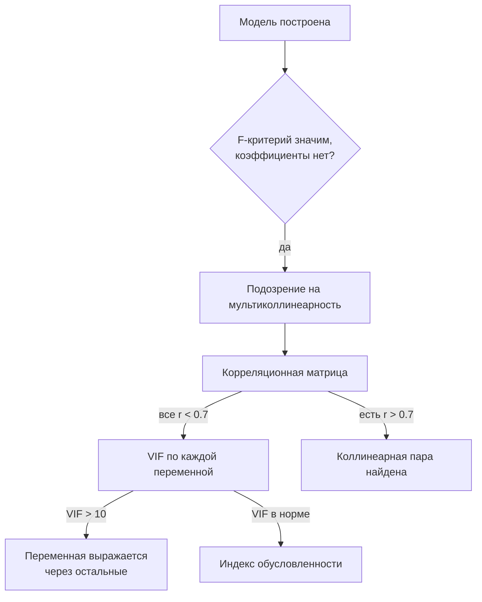

# Мультиколлинеарность: природа, признаки и диагностика

## Кратко

- Корреляция между регрессорами есть **всегда**: если система работает, её факторы связаны друг с другом. Бороться нужно не с самим явлением, а только с сильно выраженной мультиколлинеарностью.
- При полной коллинеарности ($r = \pm 1$) формулы МНК дают $0/0$ — коэффициенты не вычисляются в принципе, программа сообщает о сингулярности.
- При почти полной коллинеарности ($r \approx 0{,}99$) коэффициенты вычисляются, но состоят из численного мусора: разрядность компьютера конечна, а близкие числа вычитаются друг из друга.
- Главный клинический признак — регрессия значима в целом по F-критерию, а все или почти все коэффициенты по отдельности незначимы.
- Формальные инструменты диагностики: корреляционная матрица (порог $0{,}7$), VIF (порог $10$), индекс обусловленности (порог $30$).

## Что мы оцениваем и чему можно доверять

Модель множественной регрессии:

$$Y = \alpha + \beta_1 X_1 + \beta_2 X_2 + \varepsilon$$

- $Y$ — зависимая переменная (например, объём продаж), $X_1, X_2$ — **регрессоры** (объясняющие переменные): цена, рекламный бюджет.
- $\alpha, \beta_1, \beta_2$ — **истинные коэффициенты**. Их нельзя узнать точно никогда.
- $\varepsilon$ — **случайный член**. В него входят факторы двух разных типов: по-настоящему случайные события и закономерные, но мелкие и разнонаправленные факторы, не заслужившие отдельной переменной.

По выборке считаются **оценки** $a, b_1, b_2$ и **остатки регрессии** $e$ (в численных методах их называют невязками).

Оценки считаются по **одной-единственной** выборке. Будь выборок несколько, коэффициенты по ним отличались бы **незначимо** — за счёт случайных факторов при одинаковых математических ожиданиях.

Отсюда следствие: если на самом деле $\beta_2 = 0$, то оценка $b_2$ **всё равно не будет равна нулю**. Она будет отличной от нуля, но **незначимой** — по разным выборкам она скачет то в плюс, то в минус без всякой системы вокруг нуля. Значимый коэффициент ведёт себя иначе: он колеблется вокруг какого-то ненулевого значения.

> [!IMPORTANT]
> Никаким данным эксперимента или наблюдения нельзя доверять на 100%. Работаем не с истиной, а с вероятностью того, что вывод верен. Причём ошибка «признал значимым незначимое» и ошибка «признал незначимым значимое» — разные ошибки, одна из другой не пересчитывается.

## Природа мультиколлинеарности

**Коллинеарность** — сильная линейная связь между двумя регрессорами. **Мультиколлинеарность** — то же самое для трёх и более.

Если мы изучаем работающую систему, её факторы взаимосвязаны по определению — иначе система разваливается. Значит, количественные выражения этих факторов коррелируют. Корреляция регрессоров — это норма, а не патология.

### Предельный случай: доведение до абсурда

Приём для понимания механизма: взять самый крайний вариант связи и посмотреть, что сломается. Пусть

$$X_2 = k X_1$$

Тогда $r = 1$ (при $k > 0$) или $r = -1$ (при $k < 0$). Подставив это в формулы МНК, получаем в числителе два одинаковых слагаемых, вычитающихся друг из друга, и то же самое в знаменателе:

$$b_1 = \frac{0}{0}$$

Причина в свойствах ковариации и дисперсии: ковариация — билинейная форма, поэтому множитель $k$ выносится из неё в первой степени; дисперсия — квадратичная форма, и $k$ выносится в квадрате. Числитель и знаменатель обнуляются одновременно.

Связь вида $X_2 = k X_1 + d$ ничего не меняет: ковариация с константой равна нулю и дисперсия константы равна нулю, поэтому $d$ выпадает.

Содержательно всё логично: $X_1$ и $X_2$ здесь — **одна и та же величина в разных единицах измерения** (килограммы и граммы, доллары и рубли). Регрессор один, а записан дважды.

Что видит программа: Excel сообщит о делении на ноль, EViews напишет «сингулярность» — посчитать не может ни та, ни другая.

### Почти полная коллинеарность и численный мусор

Пусть $r = 0{,}999$. Точного $0/0$ уже нет, коэффициент формально вычислится — но результат будет мусором.

Дробные числа в компьютере представлены с конечной разрядностью (точно — только степени двойки). При $r = 0{,}999$ первые три значащие цифры в уменьшаемом и вычитаемом совпадают. Вычитая одно из другого, мы уничтожаем значимую часть и оставляем разность округлительных хвостов — то есть шум. Такой же шум получается в знаменателе. Итог: $b_1$ — это шум, делённый на шум.

Ситуацию усугубляет накопление ошибки: каждая арифметическая операция портит примерно половину последнего разряда. Много переменных → много вычислений → значимых разрядов не остаётся вовсе.

Практическое следствие: стоит чуть пошевелить выборку — и коэффициент меняется в разы и меняет знак. Предсказать, как именно, нельзя.

## Признаки выраженной мультиколлинеарности

Слабая мультиколлинеарность есть всегда — это как температура 37,1: бороться незачем. Нужны признаки того, что она стала «38».

| Признак | Что означает |
|---|---|
| Регрессия значима в целом по F-критерию, но все или почти все коэффициенты незначимы | Парадокс: $Y$ зависит от набора иксов, но не зависит ни от одного из них по отдельности. Самый явный симптом |
| Малое изменение данных сильно меняет оценки | Удалили 1 наблюдение из 30 (≈3% данных) — коэффициент изменился вдвое или в пять раз. Ожидать следует изменения того же порядка, что и изменение данных, максимум единицы процентов |
| Неправильный знак коэффициента | В модели цены квартиры $P = a + b \cdot S$ коэффициент $b$ (цена квадратного метра) вышел отрицательным: чем больше квартира, тем она дешевле — бессмыслица |
| Неоправданно большие или малые значения | Цена квадратного метра ≈ 1,43 ₽. Ограничение: «неоправданно большое» распознать труднее, чем «неоправданно малое» |

> [!WARNING]
> Проверяя устойчивость оценок, удаляйте **несколько разных** наблюдений по очереди. Одиночное удаление может попасть во **влиятельное наблюдение**, которое само по себе сильно двигает все коэффициенты. Влиятельность удобно показывать на диаграмме рассеяния кружками разного радиуса вместо точек.

## Формальная диагностика



### Корреляционная матрица

Матрица парных коэффициентов корреляции между регрессорами, симметричная относительно главной диагонали. Порог: $|r| > 0{,}7$ — связь сильная, коллинеарность есть.

Ограничение метода: он ловит только **парные** связи. Переменная может быть точно выражена через две другие, при этом попарно коррелируя с каждой слабо.

### VIF (Variance Inflation Factor)

Фактор инфляции дисперсии — инструмент для поиска именно **множественных** связей:

$$\mathrm{VIF}_i = \frac{1}{1 - R_i^2}$$

$R_i^2$ — коэффициент детерминации вспомогательной регрессии $X_i$ на **все остальные** регрессоры (не $Y$ на иксы!). То есть для трёх переменных строится три регрессии: $X_1$ на $X_2, X_3$; $X_2$ на $X_1, X_3$; $X_3$ на $X_1, X_2$.

Порог: $\mathrm{VIF}_i > 10$ — мультиколлинеарность есть. Это ровно то же самое, что $R_i^2 > 0{,}9$: при $R_i^2 = 0{,}9$ получаем $1/(1-0{,}9) = 10$.

Диагностическая ценность: большой $\mathrm{VIF}_2$ означает, что вторая переменная с высокой точностью восстанавливается по остальным и, скорее всего, лишняя.

> [!NOTE]
> Никакой дополнительной информации по сравнению с $R_i^2$ показатель VIF не несёт — судить можно и напрямую по $R_i^2$. Это вопрос сложившейся традиции, а не математики.

### Индекс обусловленности (condition index)

Работает с матричной формой записи модели:

$$Y = X\beta + \varepsilon$$

$X$ — матрица наблюдений, к которой слева дописан **столбец единиц** (он нужен, чтобы оценить свободный член $a$). Далее строится матрица $X'X$ ($X'$ — транспонированная $X$) и вычисляются её собственные значения $\lambda$:

$$\mathrm{CI} = \sqrt{\frac{\lambda_{\max}}{\lambda_{\min}}}$$

Порог: $\mathrm{CI} > 30$ — матрица **плохо обусловлена**, то есть близка к вырожденной (есть собственные значения, близкие к нулю). Все операции с ней — в первую очередь обращение — дают численный мусор.

Аналогия из смежной области: в теории дифференциальных уравнений такая система называется **жёсткой**, и обычные методы (например, Рунге—Кутты) к ней неприменимы — нужны специальные.

## Практика: цены квартир в Москве (R)

Датасет 20–25-летней давности: площади в кв. м, цена в долларах.

| Переменная | Смысл |
|---|---|
| `price` | цена квартиры |
| `totsp` | общая площадь |
| `livesp` | жилая площадь |
| `kitsp` | площадь кухни |
| `dist` | расстояние до центра, км |
| `metrdist` | расстояние до метро, минут пешком |
| `walk` | метро в шаговой доступности: 1 — да, 0 — нет |
| `brick` | материал: 1 — кирпич, 0 — панель |
| `floor` | 1 — средние этажи, 0 — первый или последний |
| `code` | код района |

Подключаемые библиотеки: `car` (расчёт VIF) и `dplyr` (обработка данных; её аналог в Python — `pandas`).

Ход работы и результаты:

1. **Диаграмма рассеяния «цена — общая площадь»** показывает **гетероскедастичность**: разброс цен растёт вместе с площадью. Это естественно — разброс цен для 32 кв. м и для 125 кв. м несопоставим.
2. **Логарифмирование** обеих переменных выравнивает картину. Более общий инструмент — **преобразование Бокса—Кокса** с параметром $\lambda$: при $\lambda = 1$ оно линейное (просто смена единиц), при $\lambda = 0$ — логарифмическое, промежуточные значения дают промежуточный результат.
3. **Корреляционная матрица** трёх площадей (логарифмы): `totsp`—`livesp` $= 0{,}84$, `totsp`—`kitsp` $= 0{,}77$, `livesp`—`kitsp` $= 0{,}50$. Все коэффициенты положительны — чем больше одна площадь, тем больше остальные.
4. **На исходных, нелогарифмированных данных**: $0{,}85$, $0{,}75$, $0{,}54$. Изменения количественные, но не качественные — логарифмирование картину связей не создаёт и не убирает.
5. **Индекс обусловленности** для матрицы логарифмов: $\mathrm{CI} = 203$ при пороге 30. Полученным коэффициентам доверять нельзя.

```r
X  <- as.matrix(f[, c("ltotsp", "llivesp", "lkitsp")])
ev <- eigen(t(X) %*% X)$values
(CI <- sqrt(max(ev) / min(ev)))
```

Внешние скобки вокруг присваивания заставляют R не только посчитать, но и вывести результат на экран.

6. **Оценка регрессии** (`lm` + `summary`) подтверждает диагноз:
    - F-статистика: `p-value < 2.2e-16` — модель в целом значима практически со стопроцентной надёжностью (`2.2e-16` — минимальное представимое системой число, фактически ноль);
    - при этом из четырёх коэффициентов значим только один: p-value остальных — 0,58, 0,34 и 0,58.

Это ровно тот самый парадокс из таблицы признаков.

## Проверка гипотез: как читать p-value

Порядок действий стандартный:

1. **Нулевая гипотеза $H_0$** — всегда об **отсутствии различий**: коэффициент равен нулю, распределение не отличается от нормального. Формулируется механически, без размышлений — здесь думать вредно.
2. **Альтернативная гипотеза $H_1$** — то, что принимается, если $H_0$ неверна. Вот её формулировка уже требует понимания задачи (односторонний критерий или двусторонний).
3. **Уровень значимости $\alpha$** — максимальная вероятность ошибки, которую мы **сами для себя** разрешаем: вероятность отвергнуть $H_0$, когда она верна (ошибка первого рода). В экономических и психологических исследованиях $\alpha = 0{,}05$.
4. **p-value** — фактическая вероятность такой ошибки для конкретного коэффициента.

Правило: $p < \alpha$ → отвергаем $H_0$, коэффициент значим. $p > \alpha$ → оставляем $H_0$, коэффициент незначим.

В примере выше: $p = 0{,}58$ — ошибиться можно в 58% случаев, отвергать $H_0$ нельзя.

> [!IMPORTANT]
> **Автокорреляция** на занятиях не разбирается: курс посвящён эконометрике **пространственных** данных, где наблюдения относятся к одному моменту времени и их можно свободно перемешать — автокорреляция при этом исчезает. Она принципиальна только для временных рядов, где порядок наблюдений хронологический и неизменяем. **При этом экзаменационные вопросы по автокоррелированности есть** — тема вынесена на самостоятельное изучение, на неё отведён больший объём часов, чем на аудиторные занятия.

> [!TIP]
> Лабораторный практикум выполняется на Python (Google Colab). Использовать ИИ и ресурсы интернета разрешено — задача в том, чтобы решить задачу, а не набить руку вручную. Возможный формат задания — перенос показанного R-кода на Python.

## Термины

| Термин | Значение |
|---|---|
| Регрессор | Объясняющая (независимая) переменная в модели |
| Остатки регрессии | Оценки случайного члена $e$; в численных методах — невязки |
| Коллинеарность | Сильная линейная связь между двумя регрессорами |
| Мультиколлинеарность | То же для трёх и более регрессоров |
| Полная коллинеарность | $r = \pm 1$; коэффициенты не вычисляются, программа даёт сингулярность |
| Влиятельное наблюдение | Наблюдение, удаление которого само по себе сильно меняет оценки |
| Гетероскедастичность | Непостоянство дисперсии остатков; здесь — рост разброса цены с ростом площади |
| Преобразование Бокса—Кокса | Семейство преобразований с параметром $\lambda$: $\lambda=1$ — линейное, $\lambda=0$ — логарифмическое |
| VIF | Фактор инфляции дисперсии, $1/(1-R_i^2)$; порог 10 |
| Индекс обусловленности | $\sqrt{\lambda_{\max}/\lambda_{\min}}$ матрицы $X'X$; порог 30 |
| Плохо обусловленная матрица | Матрица, близкая к вырожденной; вычисления с ней дают численный мусор |
| Уровень значимости $\alpha$ | Максимально допустимая вероятность ошибки первого рода; обычно 0,05 |
| p-value | Фактическая вероятность ошибиться, отвергнув верную $H_0$ |
