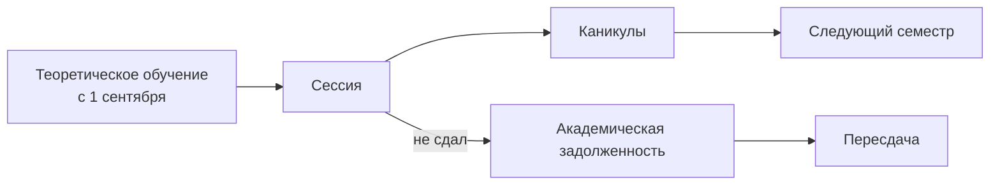

# Технология обучения в Университете Синергия

Установочный созвон с кураторами деканата: как устроены учебные системы, по каким каналам решаются вопросы и что считается выполненными обязательствами студента.

## Кратко

- Рабочих систем две: **ЛК** (единый личный кабинет) и **ЛМС** (портал обучения). Расписание, оценки, дисциплины и обращения — только в ЛМС; ЛК ещё дорабатывается и показывает расписание некорректно.
- Вход в ЛМС — через вкладку «Все сервисы» в ЛК, кнопка **на чёрном фоне**. Кнопка на белом фоне ведёт не туда.
- Все обращения в деканат — только через кнопку «Обратиться в деканат» в ЛМС. Комментарии и другие способы не обрабатываются.
- Оперативная информация (пересдачи, тьюториалы, встречи с научным руководителем, переносы занятий) приходит **только в чаты MAX**, в ЛМС её не будет. Telegram-чатов у деканата нет.
- Минимальный проходной балл — **50**. Всё ниже — неудовлетворительно и академическая задолженность.
- Посещением вебинара считается присутствие от начала до конца: перекличка может быть в начале, середине или конце.

## Учебные системы: ЛК и ЛМС

| Система | Что там | Когда нужна |
|---|---|---|
| ЛК — единый личный кабинет (`lk.synergy.ru`) | Точка входа, платежи и финансовый консультант, заказ документов, добавочные номера кураторов | Вход в систему, деньги, справки |
| ЛМС — портал обучения | Расписание, обучение, оценки, зачётная книжка, посещаемость, обращения в деканат | Всё учебное |

Логин и пароль высылаются при зачислении. Если пароль или логин не помните — сначала пройдите штатную процедуру восстановления, описанную в ЛК, и только если не вышло, пишите куратору: он отправит запрос в техподдержку.

> [!IMPORTANT]
> Расписание сверяйте по ЛМС. В ЛК оно может быть неверным — система в стадии тестирования.

### Вкладки ЛМС

- **Расписание** — занятия, ссылки на подключение, архив записей.
- **Обучение** — семестры, дисциплины, ФИО преподавателя, загрузка работ, календарный учебный график, зачётная книжка, индивидуальная посещаемость.
- **Обновления** — объявления и новости университета.
- **Колокольчик** — персональные сообщения; если на нём появилась цифра, там что-то важное.

Работы загружаются в ту дисциплину, по которой прошёл вебинар: вкладка «Обучение» → дисциплина → загрузка. Если преподаватель просил сдать работу, а места для загрузки в дисциплине нет — это ошибка, о ней нужно сообщить куратору.

## Каналы связи с деканатом

За каждым студентом закреплены **куратор 1** (основной) и **куратор 2** (дополнительный) — оба видны в личном кабинете. Если основной куратор в отпуске или на больничном, вопрос ведёт второй: договорённости не теряются.

Три способа связи:

1. Кнопка «Обратиться в деканат» в ЛМС — основной путь.
2. Телефон с добавочным номером куратора (номер указан в ЛК).
3. Почта.

Часы работы деканата — с 9:00 до 18:00.

С какими вопросами обращаться: академическая задолженность и график её ликвидации, расписание, академический отпуск (заявление на досрочный выход подаётся отдельно), индивидуальный график обучения (только с подтверждающими документами), смена научного руководителя, вопросы по практике и защите.

### Чаты MAX

Мессенджер MAX обязателен: другого канала для оперативной информации нет. Ссылки на групповые чаты рассылаются в ЛМС и на почту.

- На Gmail письма университета не доходят — проверяйте ЛМС.
- Если приглашение не пришло, напишите куратору с указанием группы.
- Свои чаты в Telegram создавать можно, но представителей деканата там нет и важная информация туда не попадёт.

Название группы читается так: первая буква **В** — вебинарная форма обучения, далее аббревиатура направления (например, ЦБ — цифровой бизнес), затем номер группы.

## Календарный учебный график

График с точными датами обучения, сессий и каникул — во вкладке «Обучение». Там же зачётная книжка.

## Оценки и модульно-рейтинговая система

Минимальный проходной балл — 50. Ниже 50 — неудовлетворительно. По ряду дисциплин возможен «автомат» по результатам работы в семестре.

Статус дисциплины в ЛМС обозначен цветом кружка:

| Цвет | Значение |
|---|---|
| Прозрачный | Сдаётся в текущем семестре |
| Зелёный | Сдана |
| Красный | Академическая задолженность |
| Серый | Будущий период |

### Пересдачи

Несданная дисциплина переходит в академическую задолженность, и на неё назначается пересдача. Обычно даётся две попытки; третья — комиссия [?]. Расписание пересдач и алгоритм записи публикуются **только в чате MAX** — это главная причина в нём состоять.

## Посещаемость и вебинары

Подключение: ЛМС → «Расписание» → нужное занятие и временной интервал → ссылка. Скачивать и регистрироваться не нужно, достаточно ввести своё имя.

Правила посещаемости:

- Занятие засчитывается при присутствии от начала до конца — перекличка бывает в любой момент пары.
- Записи вебинаров хранятся в разделе расписания: выбрать фильтр архивных занятий, применить, найти по дате.
- Просмотр записи **не снимает пропуск**: пропуск остаётся, запись нужна для содержания.
- Пропуск по состоянию здоровья закрывается справкой.
- Свою статистику видно во вкладке индивидуальной посещаемости в разделе «Обучение».

## Практика

Практика производственная. Порядок:

1. Найти организацию и заключить с ней договор до срока, указанного в карточке практики в ЛМС.
2. Если организация не найдена в срок — университет предоставляет места из своей базы.
3. Проходить практику можно в компании, где вы уже работаете.
4. С научным руководителем проводится тьюториал; ссылка приходит в чат. Если руководитель не назначен и не отображается в ЛМС — писать куратору.

## Документы, справки и воинский учёт

Студенческие офисы работают на площадках **Сокол** и **Нагатинская** (точные адреса — у куратора). С собой всегда паспорт и договор, в том числе в электронном виде, — иначе не пропустит охрана.

| Что нужно | Как получить |
|---|---|
| Студенческий билет (Москва) | Приехать в студенческий офис с паспортом и фото 3×4 |
| Студенческий билет (другой город) | Прислать документы в электронном виде |
| Справки, копии договора, доп. соглашения, справка об обучении, выписки | Заказать онлайн через ЛК, указав адрес проживания |
| Воинский учёт | Приписное свидетельство загружается в систему; вопросы — в военно-учётный стол |

Если студент за границей и не может приехать, документы в военкомат может подать только доверенное лицо по нотариальной доверенности — университет документы в военкомат не направляет.

## Финансовые вопросы и карьера

- **Финансовый консультант** закреплён за каждым студентом; его контакт — во вкладке «Платежи». Все вопросы по оплате, рассрочке и задолженности — к нему, не к куратору.
- **Центр карьеры** — стажировки и трудоустройство; контакты в презентации. Куратор эти вопросы не решает.

> [!IMPORTANT]
> Анкету по ссылке из чата нужно заполнить всем — 7 вопросов, включая ФИО и группу. По ней деканат собирает цели, обстоятельства и запрос на трудоустройство. Незаполненная анкета оставляет карточку студента незакрытой.

## Термины

| Термин | Значение |
|---|---|
| ЛК | Единый личный кабинет студента: вход, платежи, заказ документов |
| ЛМС | Портал обучения: расписание, дисциплины, оценки, обращения в деканат |
| MAX | Мессенджер, в чатах которого деканат публикует оперативную информацию |
| Куратор 1 / куратор 2 | Основной и дополнительный персональные кураторы студента |
| Модульно-рейтинговая система | Балльная система оценки; проходной минимум — 50 баллов |
| Академическая задолженность | Несданная дисциплина, переносимая на пересдачу в следующем семестре |
| Тьюториал | Встреча с научным руководителем по практике и работе |

## Есть в слайдах, но не разбиралось

- История и логотип университета, сведения о ректоре и руководстве факультета (декан — Захаров Александр Викторович [?]).
- Регламенты обращений, права и обязанности сторон.
- Подробная инструкция по воинскому учёту и адресам МФЦ.
