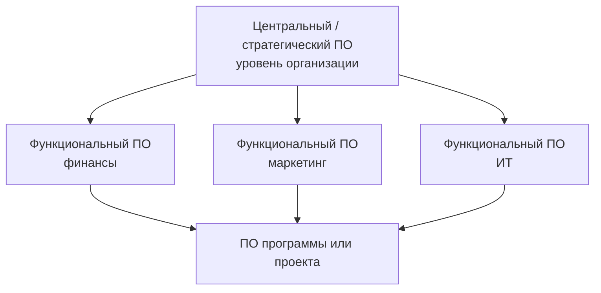
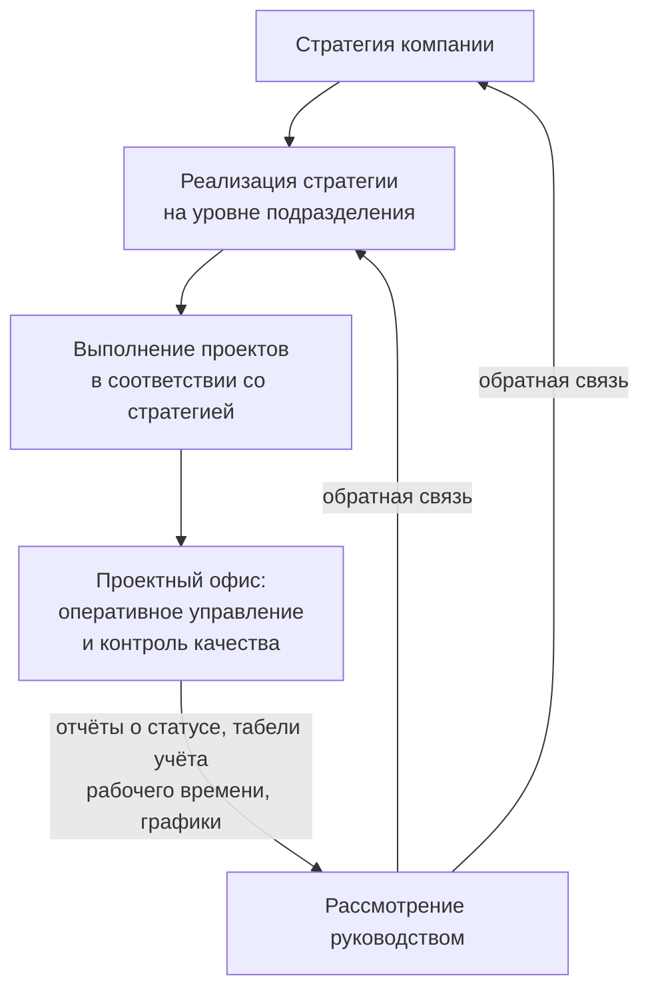

# Информатизация бизнеса и проектный офис

## Кратко

- **Автоматизация** улучшает уже существующие процессы, **информатизация** переосмысливает работу с информацией. Это разные цели, и максимальный эффект даёт только их сочетание.
- Затраты на внедрение делятся на первоначальные, операционные и **скрытые**; скрытые (прежде всего недостаток квалификации кадров) не считаются заранее, но бывают весомее прочих.
- **Проект** — временное усилие ради уникального результата. Связанные проекты объединяются в **программу**, несвязанные — в **портфель**.
- **Офис управления проектами (PMO)** — постоянное подразделение уровня организации; **офис поддержки проекта** — временная структура под один проект. Они дополняют друг друга.
- Зрелость проектного офиса растёт по четырём ступеням: регламентация → управление человеческими ресурсами → прогнозно-аналитическая деятельность → управление портфелем.
- Результаты работы проектного офиса всегда оцениваются по четырём областям: процессы, персонал, технологии, менеджмент компании.

Цель дисциплины — рассмотреть связь информатизации и цифровизации с бизнес-стратегией развития компании: понятия автоматизации, информатизации и цифровизации, ИТ-инфраструктуру предприятия и корпоративные информационные системы, подходы к построению КИС и ИТ-стратегии, основы документационного сопровождения ИТ-проектов и проектный офис. Сама лекция строится вокруг автоматизации и информатизации; цифровизация заявлена в теме, но отдельно не раскрывалась.

## Автоматизация и информатизация бизнеса

| Признак | Автоматизация | Информатизация |
|---|---|---|
| Суть | выполнение задач без участия человека | сбор, хранение и анализ данных для управленческих решений |
| Цель | оптимизировать процессы, снизить затраты, убрать влияние человеческого фактора | создать информационную среду, повысить доступность и целостность информации |
| Отношение к процессам | улучшает существующие | требует комплексного переосмысления управления информацией |
| Эффект | рост производительности, снижение числа ошибок, качество продукции | прозрачность, контроль, качество управленческих решений |

**Ключевые технологии автоматизации:**

- **BPM** (Business Process Management) — анализ, оптимизация и управление бизнес-процессами на всех уровнях организации;
- **RPA** (Robotic Process Automation) — автоматизация рутинных задач без переработки существующих систем;
- **CRM** — управление взаимодействием с клиентами, персонализация, оптимизация продаж, маркетинга и обслуживания;
- **AI и машинное обучение** — анализ данных, прогнозы, адаптивные процессы;
- **облачные технологии** — гибкость и снижение затрат на инфраструктуру;
- **ERP** — централизованное управление финансами в реальном времени;
- **мобильные технологии** — доступ к бизнес-процессам из любой точки;
- **IoT** — «умные» устройства для мониторинга и анализа процессов.

**Технологии информатизации:** системы управления данными, аналитические платформы, облачные решения, инструменты совместной работы — они интегрируют информацию из разных систем.

Информатизация внедряется этапами: анализ бизнес-процессов → выбор инструментов → обучение сотрудников → меры информационной безопасности → постоянное совершенствование. Успех зависит не столько от инструментов, сколько от культуры вовлечённости в компании.

### Затраты и отдача

1. **Первоначальные инвестиции** — ПО и оборудование. Автоматизация требует более высоких стартовых вложений; информатизация часто обходится существующими ИТ-ресурсами.
2. **Операционные расходы** — техническое обслуживание, обновление ПО, обучение персонала. Информатизация гибче: изменения ПО внедряются без закупки нового оборудования.
3. **Скрытые затраты** — заранее не считаются и не выявляются. Главный источник — квалификация и компетентность кадров, а также риски и сбои в ходе эксплуатации.

Эффективность вложений оценивается через **ROI** (возврат на инвестиции) и зависит от специфики бизнеса и отрасли: чем выше рентабельность инвестиций, тем эффективнее проект.

### Преимущества и недостатки

| Технология | Даёт | Стоит |
|---|---|---|
| Автоматизация | рост производительности, высвобождение ресурсов под сложные задачи, снижение операционных затрат | высокая стоимость внедрения; сокращение рабочих мест и вызванные этим социальные конфликты |
| Информатизация | быстрый доступ к данным и быстрые решения | зависимость от качества данных, необходимость постоянной поддержки |

Перспектива — объединение обеих технологий в единых платформах управления (ERP), применение ИИ для прогнозирования и адаптации стратегий, автономные системы. Обратная сторона роста интеграции — усиление проблем кибербезопасности.

## Базовые понятия проектной деятельности

Определения даны по стандарту управления проектами.

| Понятие | Определение |
|---|---|
| Результат (исход) | конечный результат или следствие процесса либо проекта; шире продукта — фокус на выгодах и ценностях, ради которых проект начат |
| Продукт | артефакт, поддающийся количественной оценке; либо конечный элемент сам по себе, либо составная единица |
| Проект | временное усилие для создания уникального продукта, услуги или результата; имеет явные начало и конец |
| Программа | связанные проекты, вспомогательные программы и мероприятия, управляемые скоординированно ради выгод, недостижимых при раздельном управлении |
| Портфель | проекты, программы, дочерние портфели и операции, управляемые как группа для достижения стратегических целей |
| Управление проектами | применение знаний, навыков, инструментов и техник для удовлетворения требований проекта |
| Руководитель проекта | лицо, назначенное организацией-исполнителем для руководства проектной группой и отвечающее за достижение целей проекта |
| Проектная группа | набор лиц, выполняющих работу по проекту |
| Система поставки ценности | совокупность стратегических бизнес-мероприятий по созданию, поддержанию и продвижению организации |
| Ценность | важность или полезность чего-либо |

> [!IMPORTANT]
> **Программа или портфель?** Критерий — связанность. Проекты объединены общей темой → программа. Проектов в компании много, но тематически они не связаны → портфель.
>
> Пример программы «Развитие велосипедного движения в городе»: проект строительства велодорожек + проект популяризации велодвижения + проект организации велопроката. Программа достигается только их совместной реализацией.

Ценность разные стейкхолдеры понимают по-разному: клиент — как доступные ему функции продукта, организация — как финансовый результат (выгоды за вычетом затрат на их получение), общество — как вклад в сообщество или окружающую среду.

Подходы к достижению результата бывают **прогностические**, **гибридные** и **адаптивные** — команда выбирает их под характер проекта.

## Проектный офис

**Офис управления проектами** (PMI PMBOK, 2012) — подразделение, осуществляющее централизацию и координацию управления приписанных к нему проектов.

Развёрнуто: **проектный офис** отвечает за методологическое и организационное обеспечение проектного управления в организации, планирование и контроль портфеля проектов, внедрение и развитие информационной системы планирования и мониторинга проектов, формирование сводной отчётности по программам и проектам.

### Два вида: PMO и Project Office

Термины часто используют как синонимы, но роли у них разные.

| Признак | Офис управления проектами (PMO) | Офис поддержки проекта (Project Office) |
|---|---|---|
| Уровень | вся организация | один конкретный проект |
| Срок жизни | постоянное подразделение: после закрытия проектов переключается на новые | временное: закрывается вместе с проектом |
| Задачи | стандартизация подходов и лучших практик, управление портфелем, приоритизация проектов, распределение ресурсов, планирование и управление изменениями | анализ данных, отчёты, отслеживание метрик и документации, административная поддержка команды |
| Роль | центральный координатор | обеспечение успеха реализации конкретного проекта |
| Состав | руководители проектов, методологи, администратор организации управления проектами, администратор ИСУП | руководитель проектного офиса, методолог, администратор ИСУП, администратор проектного офиса |

Оба подразделения могут существовать в организации одновременно — выбор «или-или» здесь неуместен.

### Три уровня проектных офисов

1. **Центральный (стратегический)** — планирование и контроль проектной деятельности, методологическая и административная поддержка, развитие проектно-ориентированной системы управления, портфельное управление, ведение кросс-функциональных проектов и программ.
2. **Функциональный** — те же функции, но в границах подразделения (финансы, маркетинг, персонал, ИТ).
3. **Уровня программы или проекта** — самый узкий функционал, заточенный под специфику конкретного проекта.

### Назначение в стратегическом управлении

1. Обеспечить всем заинтересованным лицам понимание текущего статуса всего перечня проектов.
2. Найти возможность выполнить больший объём работ без увеличения бюджета текущего финансового периода.
3. Обеспечить развитие персонала в области управления проектами.
4. Оптимизировать использование ресурсов компании в проектах.
5. Оценивать текущие результаты проектов на соответствие целям бизнеса.

### Цикл корректировки деятельности проектного офиса

Контур замкнутый: стратегия задаёт проекты, проектный офис ведёт их оперативно и контролирует качество, отчётность поднимается к руководству, а обратная связь корректирует и стратегию, и её реализацию на уровне подразделений.

## Зрелость проектного офиса

У проектного офиса две функции по характеру реакции:

- **реактивная** — расширять зону ответственности вслед за возникающими потребностями, рисками и проблемами компании;
- **проактивная** — предупреждать риск до его проявления. Именно проактивность повышает уровень зрелости проектного управления.

### Пять стадий зрелости

| Стадия | Характеристика |
|---|---|
| Начальный | процессы непредсказуемы, контроль слабый, управление ситуационное, координация сводится к исполнению поручений |
| Управляемый | процессы определяются заранее для каждого проекта, но возможна и реакция на ситуацию |
| Стандартизируемый | запуск проектов поставлен на поток, регламенты работают, бизнес-процессы проверены и строго определены, результат укладывается в сроки и качество |
| Измеряемый | есть чёткие количественные и качественные критерии, контроль на любом уровне иерархии, процессы проектируются от ожиданий клиентов |
| Оптимизируемый | непрерывное самосовершенствование, ставка на долгосрочные перспективы, управление на основе знаний и инноваций |

### Четыре ступени зрелости и ключевые функции

| Ступень | Содержание | Ключевая функция |
|---|---|---|
| 1. Формирование | обработка процессов | регламентация |
| 2. Расширение влияния | поддержка процессов | управление человеческими ресурсами |
| 3. Накопление и передача опыта | достижение бизнес-целей | прогнозно-аналитическая деятельность |
| 4. Стратегическое управление портфелем | реализация стратегии | управление портфелем проектов |

Каждая ступень описывается по одной схеме: **предпосылки (условия) в компании для перехода** → **действия, которые необходимо предпринять** → **функции проектного офиса** → **результаты** в разрезе четырёх областей.

### Четыре области результатов

| Область | Что оценивается |
|---|---|
| Процессы | степень регламентации |
| Персонал | наличие и квалификация |
| Технологии | степень автоматизации |
| Менеджмент компании | использование проектного подхода |

**Менеджмент компании** раскрывается через три направления помощи со стороны проектного офиса:

- *проектным менеджерам и команде* — планирование сроков, бюджета, ресурсов и мероприятий по качеству; контроль графика, выявление отклонений, решения об изменениях;
- *руководителям портфеля* — распределение проектов по финансовым возможностям, разрешение ресурсных конфликтов, ведение корпоративного реестра рисков, управление стратегическими рисками, анализ эффективности портфеля (финансирование, сроки, контракты, корпоративные ресурсы, качество и риски);
- *развитию КСУП* — обучение менеджеров и команд, разработка и развитие процессов управления проектами, регламентов и шаблонов документов, разработка ИСУП, развитие системы менеджмента качества.

**Процессы** измеряются уровнем регламентации, и он различается внутри одной компании: производство может быть регламентировано на 100%, складское хранение на 80%, а управление и развитие — почти на нуль.

| Уровень | Состояние документов |
|---|---|
| 0 | документов нет, правила складываются из практики и повторяемости действий |
| 1 | документы разработаны на бумаге, быстро теряют актуальность, в оперативной работе не используются |
| 2 | документы в электронном виде, помещены в хранилище |
| 3 | организована система управления документами, разработаны электронные модели (шаблоны) документов |
| 4 | система управления документами интегрирована с интранет-порталом, формируются электронные корпоративные стандарты и регламенты |
| 5 | действующие регламенты доведены до сотрудников, документы используются оперативно, доступ организован по стандартам |

**Технологии** — инструменты автоматизации самого проектного офиса: системы управления проектами (планирование, организация, контроль и мониторинг: задачи, календари, отчёты), BPM-системы для постановки и контроля задач, task-трекеры, онлайн-календари, онлайн-доски задач (канбан, диаграммы Ганта, сетевые графики), общие рабочие места (workflow), корпоративные мессенджеры, узкоспециализированные инструменты (софт для работы со спринтами, баг-трекеры, сервисы интегрированной аналитики). Автоматизация проектного офиса даёт: централизацию данных, снижение риска ошибок (система действует по заранее заданной логике), оперативный доступ к информации, снижение рутины за счёт шаблонов, прозрачность процессов и, как следствие, рост производительности при снижении затрат.

**Персонал** оценивается по двум параметрам:

- *наличие* — определение необходимых ролей и их распределение с учётом задач подразделения, инфраструктуры и числа проектов в портфеле. Ключевые роли: руководитель, методолог, администратор проектов или программ, администратор ИСУП.
- *квалификация* — компетенции в коммуникациях, анализе и расчётах, документировании, настройке ИСУП и взаимодействии с топ-менеджментом. Для оценки строят **модель компетенций**, включающую не только базовые знания и навыки, но и лидерские, сервисные, личностные компетенции.

Отбор персонала идёт в три шага: предварительный отбор по резюме → комплексная оценка по модели компетенций (матрица «роль × компетенции» показывает, тянет ли сотрудник конкретную роль) → индивидуальный план развития, согласованный с руководителем. Квалификация растёт и через тренинги, и через опыт работы на проектах разного уровня.

## Функции проектного офиса по ступеням

### Ступень 1. Регламентация

Разработка, внедрение, контроль исполнения и корректировка правил проектной деятельности:

- **свод шаблонов, процессов и стандартов** для всех проектов — единые правила для всех участников, меньше рисков и ошибок, быстрее запуск;
- **регламенты управления по типам проектов** — пошаговое выполнение, схемы процессов, роли и действия на каждом этапе, маршруты согласования, перечень обязательных документов;
- **шаблоны проектной документации** — готовые формы, заполняемые по ходу проекта;
- **технологические инструкции** — как работать с ИСУП, оформлять документы, запускать процессы, применять шаблоны.

Результат: единый понятийный аппарат, упрощение коммуникаций, ускорение принятия решений за счёт их типизации, фиксация и распространение успешных практик.

### Ступень 2. Управление человеческими ресурсами (HRM)

Цель — обеспечить проект людьми требуемой квалификации в необходимом количестве.

1. **Планирование** — план обеспеченности персоналом, документирование ролей, прав и обязанностей. Задача — исключить и дублирование ролей, и роли, за которые никто не отвечает.
2. **Набор команды** — из внешних источников или из действующих сотрудников компании.
3. **Развитие команды** — рост квалификации участников и улучшение коммуникации между ними; без этого команда работает вчерашними знаниями.
4. **Управление командой** — разрешение проблемных вопросов, координация изменений, обратная связь.
5. **Оценка работы** — KPI, регулярные аттестации, формальные и неформальные методы, обратная связь коллег.
6. **Мотивация** — финансовое вознаграждение плюс нематериальное: признание заслуг, условия для карьерного роста.

### Ступень 3. Прогнозно-аналитическая деятельность

Ведение статистики по проектам; формирование аналитических отчётов и нормативных оценок для планирования; создание общей базы знаний, включая типовые иерархические структуры работ и реестр типичных рисков; отслеживание удовлетворённости заказчика; встречи для обмена опытом и знакомства с лучшими практиками. Смысл — анализировать не только каждый проект отдельно, но и общую картину по всем проектам сразу; это и оптимизирует принятие решений.

### Ступень 4. Управление портфелем проектов

Организация и контроль проектных процессов, связанных со множеством проектов сразу. Цель — чтобы проекты соответствовали целям компании, были сбалансированы между собой (один проект не обнуляет другой) и укладывались в наличные ресурсы.

1. **Определение стратегических приоритетов** — анализ бизнес-целей для формирования стратегии выбора проектов.
2. **Оценка проектов** — риски, затраты, ожидаемые выгоды; методики анализа затрат и выгод, SWOT-анализ.
3. **Управление ресурсами** — единая база доступных ресурсов и их загруженности.
4. **Мониторинг и оценка результатов** — сроки, бюджет, качество.
5. **Управление рисками** — идентификация, анализ и разработка стратегий минимизации.
6. **Коммуникация и отчётность** — прозрачность и регулярное информирование заинтересованных сторон.
7. **Управление изменениями** — организация обсуждения и согласования изменений в проектах и портфеле.

> [!IMPORTANT]
> **Магический треугольник управления проектами.** При заданном объёме работ три вершины — **сроки**, **бюджет**, **качество** — жёстко связаны: изменение одного параметра автоматически меняет остальные.
>
> Нужно выше качество — растут сроки либо бюджет. Нужно сократить сроки — растёт бюджет, иначе просядет качество. Поэтому мониторинг портфеля ведётся сразу по всем трём параметрам, а не по одному.

## Ступень 1: предпосылки создания проектного офиса

Условия, при которых компания готова перейти на первую ступень зрелости, — по четырём областям:

| Область | Предпосылка |
|---|---|
| Процессы | существующая практика формализации основных бизнес-процессов и централизации обслуживающих |
| Менеджмент компании | понимание отличий проектной деятельности от операционной, потребность в регламентации управления проектами |
| Технологии | практика автоматизации бизнес-процессов, наличие корпоративного хранилища информации (портала) |
| Персонал | базовые знания по управлению проектами у руководителей проектов, высокий средний уровень их компьютерной грамотности |

## Термины

| Термин | Значение |
|---|---|
| BPM-система | система управления бизнес-процессами: моделирование, анализ, постановка и контроль задач |
| RPA | программная роботизация рутинных операций без участия человека |
| ROI | возврат на инвестиции; отношение отдачи от проекта к вложенным средствам |
| ИСУП | информационная система управления проектами |
| КСУП | корпоративная система управления проектами |
| Модель компетенций | описание требуемых знаний, навыков и качеств для роли; основа оценки и отбора персонала |
| Регламентация | разработка, внедрение, контроль исполнения и корректировка правил проектной деятельности |
| Скрытые затраты | расходы, которые нельзя посчитать заранее; чаще всего связаны с квалификацией кадров и сбоями эксплуатации |
| Магический треугольник | взаимозависимость сроков, бюджета и качества при фиксированном объёме работ |

## Что дальше

Занятие закончилось на предпосылках ступени I. Ступени I–III разобраны в следующем конспекте: [Проектный офис на ступенях зрелости I–III](02-proektnyj-ofis-stupeni-zrelosti-1-3.md).

Оставшаяся часть презентации (слайды 94–130) — материал последующих занятий: ступень IV «Стратегическое управление портфелем» (критерии отбора проектов, NPV, IRR, дисконтированный срок окупаемости, индексы доходности, анализ отклонений, ИСУПП, жизненный цикл портфеля, роли руководителя и аналитика портфеля, балансировка) и оценка деятельности проектного офиса (критерии, параметры и карта эффективности по ступеням).
