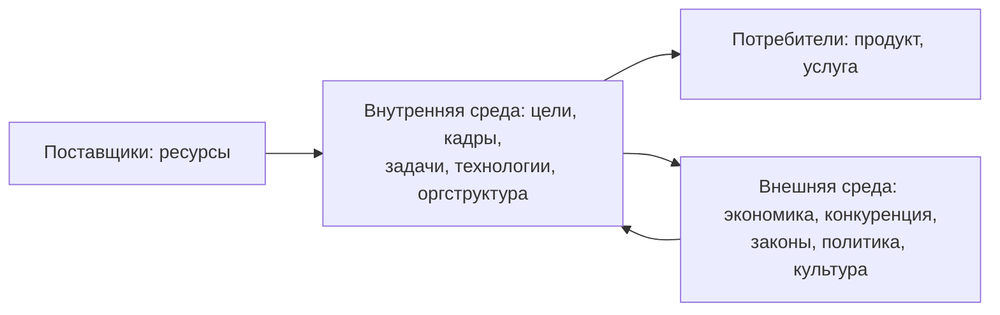

# ITSM, ITIL 4 и основы управления ИТ-проектами

Завершение темы 2 (начало — в конспекте [03](03-strategicheskoe-upravlenie-portfelem-proektov.md)) и начало темы 3: сервисный подход к управлению ИТ, ИТ-инфраструктура и её стоимость, затем базовые понятия проектного управления.

## Кратко

- ИТ и бизнес влияют друг на друга: ИТ перестают быть обособленным подразделением и встраиваются в управление предприятием, а информация становится стратегическим ресурсом и товаром.
- **ITSM** — концепция, при которой ИТ-отдел выступает поставщиком услуг для бизнес-подразделений; отношения формализуются как «поставщик сервисов — потребитель сервисов» с заданным уровнем качества.
- **ITIL** — не стандарт, а библиотека лучших практик, по которой ITSM внедряется. ITSM отвечает на вопрос «что и зачем», ITIL — «как именно».
- В ITIL 4 (2019) вместо процессов введены **34 практики**: 14 общего управления, 17 управления услугами, 3 технического. Ядро — система создания ценности и четыре измерения.
- ИТ-инфраструктура оценивается по пяти качествам (доступность, надёжность, безопасность, адаптивность, эффективность), и выгоду от неё нужно балансировать с совокупной стоимостью владения.
- Все определения проекта сходятся в трёх признаках: временный характер, уникальный результат, ограничения по времени, стоимости и ресурсам.
- **Магический треугольник**: объём и качество, затраты, сроки связаны жёстко — изменение одной вершины требует изменения двух других, иначе страдает качество.

## Взаимодействие ИТ и бизнеса

Информационные системы должны быть полностью интегрированы в деятельность предприятия, а бизнес — чувствовать поддержку ИТ и извлекать выгоду из новых технологий. Поэтому ИТ смещаются в центр концепции управления предприятием.

На это взаимодействие влияют структура бизнеса, организационно-функциональное построение, бизнес-правила, корпоративная культура, опыт управленцев, внутренние технологические процессы и внешнее окружение. Менеджер обязан учитывать эти факторы и при внедрении новых ИТ, и при управлении существующими системами.

Главная задача информационной системы предприятия — обеспечить информационное взаимодействие между внешним окружением и внутренней средой.

Компания не может оставаться стабильной: она обязана меняться, чтобы удовлетворять меняющиеся требования потребителей и не уступать конкурентам. Система управления должна отслеживать изменения во внешнем мире и превращать их в изменения стратегии и политики.

## Информация как ресурс

### Требования к качеству информации

| Свойство | Что означает |
|---|---|
| Достоверность | Не искажает истинного положения дел во внешней и внутренней среде |
| Полнота | Достаточна для понимания ситуации и принятия решения |
| Ценность | Мера расширения полезной совокупности сведений и смысловых связей между ними |
| Адекватность | Информационный образ соответствует реальному объекту, процессу, системе |

Ценность одной и той же информации относительна: она зависит от временного периода, ситуации и конкретного пользователя. Потребителем может быть человек, подразделение, модуль корпоративной системы или другая информационная система.

Информационные потоки, источники информации и хранилища знаний — такие же активы предприятия, как материальные.

### Три источника информации для управленческих решений

| Источник | Особенность | Ограничение |
|---|---|---|
| Внешний мир (клиенты, партнёры, конкуренты, государство) | Плохо контролируется, поставляет информацию когда и какую хочет | Может быть неполной, недостоверной или ложной |
| Предприятие (руководители всех уровней, исполнители) | Формально управляемый источник | Субъективна: разные должности, образование, опыт и цели |
| Руководитель (опыт, интуиция, связи) | Аккумулирует, сортирует и анализирует информацию | Отбирает то, что кажется полезным именно ему |

Руководителю нужны собранные и обработанные данные, распределённые по направлениям финансово-экономической и производственной деятельности, — пригодные для анализа и достаточные для решения.

## Как ИТ изменили правила работы с информацией

| Прежнее правило | Новое правило | За счёт чего |
|---|---|---|
| Информация появляется в одном месте в одно время | Информация доступна в любом месте и в любое время | Распределённые БД, хранилища данных, поисковые системы |
| Сложную оценку ситуации выполняют только эксперты | Работу эксперта выполняет специалист общего профиля | Экспертные системы |
| Нужно выбирать между централизацией и децентрализацией | Можно сочетать обе формы управления | Телекоммуникации и сети |
| Все решения принимают высшие руководители | Решение — часть работы каждого сотрудника на своём участке | Системы поддержки принятия решений, базы знаний |
| Для работы с информацией нужны специально оборудованные помещения | Информация доступна с рабочего места и мобильно | Мобильный доступ к хранилищам и поисковым системам |
| Лучший контакт с покупателем — личный | Лучший контакт — эффективное изучение особенностей покупателя | Интерактивное взаимодействие, БД, системы опросов и выявления предпочтений |
| Планы не пересматриваются (только при форс-мажоре) | Планы корректируются оперативно под требования потребителя | Гибкое планирование и управление рисками, Agile |

## Тенденции развития ИТ

1. **Глобализация.** Дела ведутся на мировом рынке с немедленным получением информации; распределение информационных расходов на широкий географический регион становится элементом стратегии.
2. **Конвергенция.** Стираются различия между изделиями и услугами, информационным продуктом и средствами его получения, профессиональным и бытовым использованием; цифровые, звуковые и видеосигналы объединяются в одних устройствах.
3. **Усложнение информационных продуктов и услуг** при одновременном упрощении интерфейсной части.
4. **Способность к взаимодействию.** Оптимальный обмен данными между системами и с пользователями стал ведущей технологической проблемой.
5. **Ликвидация промежуточных звеньев.** Заказ размещается и исполняется напрямую, цепочка посредников не нужна.

Для бизнеса это означает: распределённую обработку данных на рабочих местах, развитые системы коммуникации, устранение помех в интеграции «организация — внешняя среда», системы электронных заказов и торговли, поддержку социальных сетей.

## ИТ-подразделение и ИТ-стратегия

ИТ-подразделение сегодня — партнёр бизнеса, формирующий добавочное качество наравне с производственными подразделениями, а не поставщик элементов инфраструктуры. Эффективность ИТ-подразделения и эффективность основного бизнеса связаны в обе стороны; осознание этого превращает ИТ в конкурентное преимущество.

Вопросы, на которые нужно ответить при организации работы ИТ-подразделения:

- каких целей оно должно достигать и как сбалансировать цели бизнеса и цели в области ИТ;
- как оценивать степень достижения целей и эффективность специалистов;
- по каким параметрам контролировать деятельность подразделения;
- какие процессы наиболее критичны с точки зрения автоматизации;
- какие ИТ-проекты приоритетны.

ИТ-стратегия должна вытекать из стратегии компании (а не противоречить ей), быть согласованной с пожеланиями всех подразделений, охватывать все стороны деятельности ИТ, иметь много общего с бизнес-планом (затраты на информатизацию и отдача от них, обучение персонала, владение технологиями) и указывать пути снижения затрат и потерь.

## ITSM: сервисный подход к управлению ИТ

**ITSM (IT Service Management)** — подход к управлению и организации ИТ-услуг, направленный на удовлетворение потребностей бизнеса. Реализуется оптимальным сочетанием людей, процессов и информационных технологий.

Суть подхода:

1. ИТ-отдел перестаёт отвечать только за серверы, сети и приложения и становится поставщиком сервисов.
2. Бизнес-подразделения формулируют требования к спектру услуг и их качеству.
3. ИТ поддерживает и развивает инфраструктуру так, чтобы обеспечить запрошенный сервис с заданным качеством.
4. Полный переход на сервисную основу превращает затратное подразделение в центр прибыли и позволяет продавать услуги за пределами организации — вплоть до статуса департамента с независимым бюджетом.

В отличие от технологического подхода, ITSM концентрируется на клиенте и услуге, а не на самих технологиях. Заранее оговорённые в **соглашениях об уровне услуг (SLA)** параметры эффективности позволяют измерять и улучшать качество.

Реализация ITSM требует формализации: для каждого процесса определяются последовательность работ, ресурсы, затраты времени, средства автоматизации и контроля качества. Документированный процесс с явными входами и выходами можно измерить — а это условие задачи «сервис заданного качества за определённую стоимость». Сюда же входят регламенты работы сотрудников, зоны ответственности и полномочия, критерии качества и механизмы мониторинга.

### Принципы ITSM

- ориентация на клиента и потребности бизнеса;
- целостный подход: интеграция процессов, людей, технологий и информации;
- непрерывное улучшение качества услуг и процессов;
- управление жизненным циклом услуги — от разработки до прекращения;
- управление изменениями и рисками с минимальными негативными последствиями.

Изложение ITSM системно: каждый элемент (управление инцидентами, конфигурациями, безопасностью) рассматривается во взаимосвязи с остальными службами и процессами.

## ITIL: библиотека лучших практик

Появилась в конце 1980-х по инициативе британского правительства, которое хотело повысить качество и эффективность ИТ-услуг для государственных учреждений. Цель — стандартизированный набор лучших практик управления инфраструктурой и сопровождения ИТ-услуг с ориентацией на бизнес-потребности.

Первоначально — комплект более чем из 30 документов; в последующих версиях материал систематизировали и упростили. Актуальна **ITIL 4** (2019). Это не жёсткий стандарт: фреймворк предлагает проверенные подходы, которые организация адаптирует под свои задачи, культуру и контекст.

### Жизненный цикл услуги: пять стадий

1. **Стратегия услуг** — разработка стратегий предоставления ИТ-услуг, согласованных с бизнес-целями.
2. **Проектирование услуг** — планирование новых или изменённых услуг и процессов.
3. **Переход услуг** — внедрение услуг в эксплуатацию.
4. **Эксплуатация услуг** — обеспечение эффективного функционирования.
5. **Постоянное улучшение услуг** — систематическое улучшение на основе анализа эффективности.

Классические процессы управления ИТ: управление инцидентами, проблемами, изменениями, уровнем услуг, доступностью, конфигурациями.

### ITIL 4: система создания ценности

Система создания ценности услуг — совокупность взаимосвязанных компонентов и действий, с помощью которых организация создаёт ценность через ИТ-услуги. Её элементы: цепочка создания ценности, руководящие принципы, практики управления, постоянное улучшение.

**Цепочка создания ценности** состоит из шести видов деятельности: планирование, улучшение, взаимодействие, проектирование и преобразование, приобретение и сборка, поставка и поддержка.

**Четыре измерения**, которые нужно учитывать для сбалансированного управления услугами:

1. организации и люди;
2. информация и технологии;
3. партнёры и поставщики;
4. потоки создания ценности и процессы.

### Практики вместо процессов

В ITIL 4 понятие процесса заменено более широким понятием **практики**.

| Критерий | Процесс | Практика |
|---|---|---|
| Объём | Упорядоченный набор действий с чёткой последовательностью, началом и концом | Объединение всех ресурсов и элементов, нужных для результата |
| Компоненты | Только последовательность действий | Люди, процессы, технологии, информация, партнёры |
| Гибкость | Жёстко регламентирован | Допускает адаптацию и интеграцию элементов |
| Цель | Выполнение конкретных операций | Создание ценности сочетанием разных инструментов управления |

Процессы никуда не делись — они рассматриваются как часть более широкой системы. Одна практика может включать несколько процессов и функций: например, практика управления изменениями охватывает координацию изменений, контроль рисков и коммуникации.

Всего 34 практики в трёх группах:

| Группа | Число | Примеры |
|---|---|---|
| Практики общего управления | 14 | Управление портфелем, рисками, знаниями, организационными изменениями, безопасностью, проектами |
| Практики управления услугами | 17 | Управление инцидентами, проблемами, изменениями, релизами, уровнем услуг, запросами на обслуживание, доступностью, конфигурациями и активами |
| Практики технического управления | 3 | Управление инфраструктурой и платформами, управление развёртыванием, управление разработкой ПО |

### ITSM и ITIL: в чём разница

| ITSM | ITIL |
|---|---|
| Общее понятие: философия и практика управления сервисами | Детализированный фреймворк |
| Набор принципов, процессов и практик предоставления ИТ-услуг | Конкретные методологии, процессы, роли и рекомендации |
| Отвечает на вопрос «что и зачем» | Отвечает на вопрос «как именно строить и улучшать» |

ITSM реализуется не только через ITIL: к нему же относятся стандарты контроля за ИТ, модели зрелости и другие технические руководства [?] — конкретные названия в записи не разобрать.

### Что даёт сервисный подход

- повышение качества услуг: стандартизированные процессы уменьшают число ошибок и ускоряют реагирование;
- сокращение затрат за счёт оптимизации процессов и ресурсов;
- согласование ИТ и бизнеса: услуги отвечают реальным потребностям;
- управление рисками и изменениями: меньше сбоев и непредвиденных последствий;
- рост удовлетворённости клиентов за счёт надёжности сервисов;
- гибкость: прозрачность процессов позволяет быстро реагировать на изменения;
- база для внедрения новых технологий и цифровой трансформации.

Взаимодействие бизнеса и ИТ в рамках ITSM строится на четырёх принципах: альянс бизнеса и ИТ, фокус на бизнес-результатах, совместное управление жизненным циклом услуги, обратная связь и непрерывное улучшение.

## Зрелость организации в развитии ИТ

Оценивается по пяти критериям:

1. **Стратегическая интеграция ИТ и бизнеса** — ИТ-стратегия как часть общей бизнес-стратегии.
2. **Процессная зрелость** — формализованные, стандартизированные и оптимизированные процессы ITSM.
3. **Организационная культура и компетенции** — развитые компетенции сотрудников, поддержка обучения.
4. **Использование технологий** — инструменты автоматизации, мониторинга и аналитики.
5. **Непрерывное улучшение** — совершенствование процессов на основе метрик и обратной связи.

Высокая зрелость даёт скорость адаптации к рынку, снижение издержек и рисков, рост удовлетворённости пользователей.

## ИТ-инфраструктура

**ИТ-инфраструктура** — организационно-техническое объединение программных, вычислительных и телекоммуникационных средств, связей между ними и эксплуатационного персонала, обеспечивающее подразделения предприятия ресурсами и услугами, необходимыми для решения бизнес-задач.

Это не набор случайно собранных ИТ-решений: один процесс может обеспечиваться несколькими системами, системы обмениваются данными, а системы низкого уровня служат механизмом реализации систем более высокого. Инфраструктура на порядок превосходит по масштабу каждую из своих частей.

### Пять ключевых качеств

| Качество | Что обеспечивает |
|---|---|
| Доступность | Доступ к ресурсам и сервисам из любого места и в любой момент (сетевой принтер, почта, удалённый доступ к системе) |
| Надёжность | Отказ оборудования не становится катастрофой: резервное копирование, бесперебойное питание, подменное оборудование, резервный канал связи, автономный режим |
| Безопасность | Разграничение доступа к ресурсам и информации, аутентификация, ограничение прав, защита коммерческой тайны |
| Адаптивность | Гибкость и масштабируемость: изменения происходят так же быстро, как меняется бизнес, и безболезненно для людей |
| Эффективность | Компоненты отвечают целям бизнеса при минимальных капиталовложениях, справляются с ростом объёмов данных и требованиями законодательства |

### Совокупная стоимость владения

Выгоду от инфраструктуры нужно балансировать с расходами на неё. В стоимость владения входят:

- оборудование, его монтаж и пусконаладочные работы;
- программное обеспечение, его установка, настройка и обновления;
- расходные материалы;
- техническая поддержка от производителей ПО и оборудования;
- оплата труда персонала, настраивающего и поддерживающего систему, плюс налоги и отчисления с ФОТ;
- ремонт оборудования и материалы для планового обслуживания;
- связь, в том числе интернет;
- обучение ИТ-персонала и конечных пользователей;
- серверное помещение: электроэнергия, вентиляция, кондиционирование;
- амортизация оборудования;
- потери от простоев из-за неполадок в инфраструктуре.

## Тема 3. Основы управления ИТ-проектами

> [!IMPORTANT]
> Формы контроля по темам различаются: тема 1 — эссе, тема 2 — реферат, темы 3–5 — лабораторный практикум.

### Почему управление проектами актуально сейчас

- жизненный цикл продукта сокращается, времени на разработку остаётся всё меньше;
- выпускать продукт нужно раньше конкурентов, иначе прибыль уйдёт к ним;
- появляются новые рынки и растёт глобальная конкуренция: информация о товарах расходится мгновенно и обесценивает преимущество новизны;
- требования покупателей к функционалу и качеству постоянно меняются;
- продукты и технологии усложняются, проекты используют самые новые знания;
- растёт мультипроектная среда — неорганизованный отбор проектов и неэффективное управление ими ведут к большим финансовым потерям.

### Что такое проект

| Источник | Определение |
|---|---|
| ГОСТ Р 54869-2011 | Комплекс взаимосвязанных мероприятий, направленный на создание уникального продукта или услуги в условиях временных и ресурсных ограничений |
| PMBOK (PMI) | Временное предприятие, предназначенное для создания уникального продукта, услуги или результата |
| IPMA (ICB) | Уникальное, временное, мультидисциплинарное и организованное усилие, направленное на согласованный конечный результат в рамках предопределённых требований и ограничений |
| ISO/TR 10006 | Уникальный процесс из набора взаимоувязанных контролируемых работ с датами начала и окончания, предпринятый для соответствия конкретным требованиям |
| P2M | Обязательство создать ценность в рамках согласованных времени, ресурсов и условий эксплуатации |
| PRINCE2 | Временная организация, созданная для получения уникального предопределённого результата в заранее определённое время с заранее определёнными ресурсами |
| Мировой банк | Комплекс мероприятий для достижения поставленных задач с чётко определёнными целями в течение заданного периода и при установленном бюджете |

Формулировки различаются, но ядро у всех одно: проект **временный** (есть начало и окончание), даёт **уникальный** результат и работает **в ограничениях** по времени, стоимости и ресурсам.

### Классификация проектов

| Признак | Виды |
|---|---|
| По срокам | Краткосрочные (до года), средние (2–5 лет), длительные (более 5 лет) |
| По бюджету (размеру инвестиций) | Мелкие, средние, крупные |
| По наличию доходной части | С доходной частью; «бездоходные» — бюджетная сфера: культура, образование, здравоохранение, экология |
| По функциональным и предметным областям | Организационные, производственные, маркетинговые, информационные |
| По задействованным подразделениям | Монофункциональные (объект выполняет одну функцию); кросс-функциональные (решают много задач, объединяют представителей разных отделов) |

Список признаков открытый — в литературе встречаются и другие, их можно дополнять.

### Критерии успеха и неудач

**Традиционные:** проект достиг намеченной цели; выполнен в срок; выполнен в рамках бюджета; качество обеспечено согласно спецификациям (ГОСТы, технические условия); работа принята заказчиком.

**Вторичные** — говорят об успехе косвенно: проект соответствует стратегии развития компании; укрепился имидж на рынке; расширился референс-лист; выросла лояльность существующих клиентов и привлечён новый сегмент; не пострадала корпоративная культура; заключены выгодные контракты; улучшились отношения с партнёрами; соблюдены нормы безопасности; получен персонал, обученный проектному менеджменту; намечены новые стратегические перспективы.

### Магический треугольник

Три вершины — **объём и качество работ**, **затраты**, **сроки**. «Магический» он потому, что вершины связаны: изменение одной требует изменения двух других, чтобы треугольник сошёлся. Если изменить один элемент, не тронув остальные, треугольник рвётся — и страдает качество проекта.

| Что меняем | Что придётся сделать |
|---|---|
| Сократить сроки | Либо увеличить затраты (нанять людей), либо смириться с падением качества |
| Сократить затраты | Либо растянуть сроки, либо урезать объём и качество работ |
| Усложнить задачу (расширить содержание) | Увеличить бюджет или сроки |

Отсюда три инструмента контроля:

1. **Контроль затрат** — содержание работ напрямую влияет на затраты, поэтому выход за бюджет предотвращается переносом части задач на будущее.
2. **Контроль содержания** — при усложнении задачи менеджер видит, что нужен либо больший бюджет, либо больший срок.
3. **Контроль сроков** — при риске срыва можно увеличить бюджет (дополнительные специалисты) или сократить объём работ.

### ИТ-проекты и их особенности

**ИТ-проекты** — проекты по созданию, внедрению и поддержке информационных технологий или цифровых продуктов. Охватывают образование, бизнес, науку, технологии, социальные науки.

| Характеристика | Содержание |
|---|---|
| Цель | Чёткая и вытекающая из ИТ-специфики: создание базы данных, разработка ПО, построение информационной системы |
| Этапы разработки | Планирование, разработка, тестирование, внедрение |
| Технологии | Базы данных, облачные сервисы и другие современные инструменты |
| Участники | Менеджер проекта, команда проекта, оргструктура проекта; программисты, дизайнеры, аналитики, исследователи |
| Пользователи | От широкой общественности до узкоспециализированных профессионалов |

## Есть в слайдах, но не разбиралось

Материал презентации после слайда об особенностях ИТ-проектов

- цели ИТ-проектов по типам: модернизация инфраструктуры, интеграция систем, разработка сайтов и приложений, автоматизация бизнес-процессов;
- шесть этапов разработки ИТ-проекта: планирование, анализ требований, проектирование и дизайн, разработка, тестирование и интеграция, поддержка;
- виды тестирования: функциональное, регрессионное, системное и другие;
- виды поддержки: техническая поддержка, мониторинг и обнаружение сбоев, обновление, резервное копирование и восстановление, консультации и планирование;
- инструменты управления проектами: Microsoft Project, Primavera, Spider Project, Project Expert, «Альт-Инвест», 1C:PMO;
- участники проекта: менеджер проекта, команда проекта, команда управления проектом;
- стейкхолдеры: матрица анализа влияния и интересов, карта заинтересованных сторон;
- команда: определение ролей, стадии развития группы, групповые роли;
- организационные структуры проекта, их сравнение и выбор типа;
- коммуникации в проекте и базовый план проекта;
- управление рисками: классификация, идентификация, качественная и количественная оценка, матрица вероятности и влияния, анализ предельного уровня и чувствительности, имитационное моделирование, дерево решений, план управления рисками, мониторинг и контроль реагирования.

## Термины

| Термин | Значение |
|---|---|
| ITSM | Подход к управлению ИТ через услуги для бизнеса: сочетание людей, процессов и технологий |
| ITIL | Библиотека лучших практик управления ИТ-услугами; актуальная версия — ITIL 4 (2019) |
| SLA | Соглашение об уровне услуг: заранее оговорённые параметры качества и эффективности сервиса |
| Практика (ITIL 4) | Комплекс ресурсов — людей, процессов, технологий, информации, партнёров — для достижения цели |
| Система создания ценности услуг | Совокупность компонентов и действий, через которые организация создаёт ценность посредством ИТ-услуг |
| Четыре измерения | Организации и люди; информация и технологии; партнёры и поставщики; потоки создания ценности и процессы |
| ИТ-инфраструктура | Объединение программных, вычислительных и телекоммуникационных средств, связей и персонала для решения бизнес-задач |
| Совокупная стоимость владения | Суммарные затраты на приобретение, внедрение, эксплуатацию и поддержку ИТ-инфраструктуры, включая потери от простоев |
| Проект | Временное предприятие с уникальным результатом в условиях ограничений по времени, стоимости и ресурсам |
| Магический треугольник | Взаимосвязь объёма и качества, затрат и сроков: изменение одной вершины требует изменения других |
| Кросс-функциональный проект | Проект, решающий много задач и объединяющий представителей разных отделов организации |
| Референс-лист | Перечень реализованных проектов и клиентов, предъявляемый потенциальным заказчикам |
